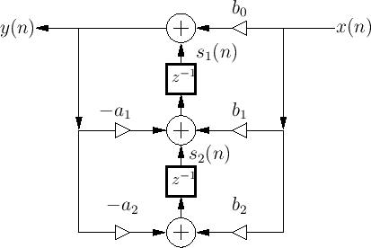

# Ultrasonic sensor Height Classification using analog waveform features

This repository implements a **signal processing + machine learning pipeline for ultrasonic sensing**, focusing on **Height Classification** of localized objects using analog waveform features.

> This work represent my research dissertation thesis project:  
> **"Ultrasonic sensor Height Classification using analog waveform features"**   
> *(Faculty of Electronics, Telecommunications and Information Technology, Cluj-Napoca 2025).*  

## 🚀Project Overview

Ultrasonic sensors provide reliable range information for object detection in parking scenarios. Height classification is a paradigm where sinGle or multiple ultra sonic sensors are used in order to estimate the height of identified objects in the scene with the scope of determining if the object are traversable or not by the car.

In order to do that echo detection and feature extraction are essential for building robust algorithms for identifying the type of object. For this are applying both signal processing techniques and machine learning algorithms to effectively extract and process information from the analog signal, which encapsulates the information of ultra sound waves reflected by objects situated in the surrounding of the vehicle.

This project develops both online and post-processing methods for ultrasonic echo detection and integrates them into a classification pipeline. The extracted features are used to train machine learning models for height classification tasks on a rp2350 micro-controller.

## 🎯Table of Contents

- [Ultrasonic sensor Height Classification using analog waveform features](#ultrasonic-sensor-height-classification-using-analog-waveform-features)
  - [🚀Project Overview](#project-overview)
  - [🎯Table of Contents](#table-of-contents)
  - [⚡Microcontroller](#microcontroller)
  - [📂Dataset](#dataset)
  - [🔊Signal Processing](#signal-processing)
    - [Sampling](#sampling)
    - [Filtering](#filtering)
    - [Envelope](#envelope)
    - [Detection](#detection)
  - [🤖Machine Learning](#machine-learning)
    - [Data analysis](#data-analysis)
  - [🔧Building the project](#building-the-project)
  - [📚Bibliography](#bibliography)

## ⚡Microcontroller
  * Low power, low cost compared to GPU/CPU inference.

  * Suitable for real-time, embedded ultrasonic sensing (e.g., in cars).

  * Constraints: limited RAM (tens–hundreds of KB), flash storage, and no floating-point hardware on some MCUs.

  * RP2350 (Raspberry Pi RP2040 family).

  * Dual ARM Cortex-M33+ (150 MHz)

  * 264 KB SRAM

  * FPU enables fast IRR and FIR filters

## 📂Dataset
  The dataset is consisted of different objects measured by a sensor, mounted at 50 and 30 cm from the floor:
  * pole
  
  * cone
  
  * mini cone
  
  * curbstone (20 cm)
  
  * box (20 cm)
  
## 🔊Signal Processing
  Digital signal processing comprises the set of operation performed on the ultra sonic signal. The whole processing pipeline contains:
  * Sampling
  * Filtering
  * Envelope
  * Echo detection
  
  ### Sampling
  The ultra sonic signal is sampled using a 12-bit ADC using DMA. The sampling frequency is set to 125 kHz, obtained by diving the 40Mhz USB clock rate.
       
  
  ### Filtering
  Filtering is essential in order to preserve the meaningful information in the receiver. A 5-th order IIR Bandpass Butterworth filter is used to remove the noise outside the 35 to 45 kHz range. The procedure is implemented by cascading multiple biquad filters using the Transposed Direct Form 2, see figure 1.
  
  **Transfer function:**  
  $H(z) = \frac{Y(z)}{X(z)} = \frac{(b₀ + b₁·z⁻¹ + ... + bM·z⁻ᴹ)} {(1 + a₁·z⁻¹ + ... + aN·z⁻ᴺ)}$ 
  
  **Output calculation:**  
  $y[n] = b₀·x[n] + s₁[n]$

  **State udpate:**  
  $s₁[n+1] = b₁·x[n] + s₂[n] − a₁·y[n]$  
  $s₂[n+1] = b₂·x[n] − a₂·y[n]$

  ### Envelope
  The envelope is obtained by extracting the absolute value of the analytical signal. The analytical signal is obtained from the spectrum of the filtered signal by cancelling the negative components. An alternative approach for obtaining the analytic signal is by computing the hilbert transform of the filtered signal.

  Analytic signal:  
  $Z(f) = X(f) + \text{sgn}(f) \cdot X(f)$  
  $z(t) = x(t) + j \cdot Hilbert(x(t))$

  Envelope:   
  $∣z(t)∣ = \sqrt{x(t)^2 + \hat{x}(t)^2}$

  ### Detection
  We determine the global maximum starting from a distance of 25 cm. We window the region corresponding to the peak with a margin of 100 samples each side, for further feature extraction.

## 🤖Machine Learning
  ### Data analysis
  To ensure optimal performance of machine learning algorithms, it is essential to conduct thorough data analysis aimed at identifying the most informative features. Feature extraction begins with evaluating the relevance and predictive power of each variable. This process often involves both statistical and algorithmic techniques.

  One common approach is univariate feature selection, which assesses each feature individually based on statistical tests. Tools like **SelectKBest** from **scikit-learn** allow practitioners to rank features according to their correlation with the target variable, helping to isolate those with the highest explanatory value.

  Beyond univariate methods, more advanced techniques such as **recursive feature elimination (RFE)**, **principal component analysis (PCA)**, and **embedded methods** (e.g., feature importance from tree-based models) can be employed to capture complex interactions and reduce dimensionality while preserving model accuracy.

## 🔧Building the project

## 📚Bibliography